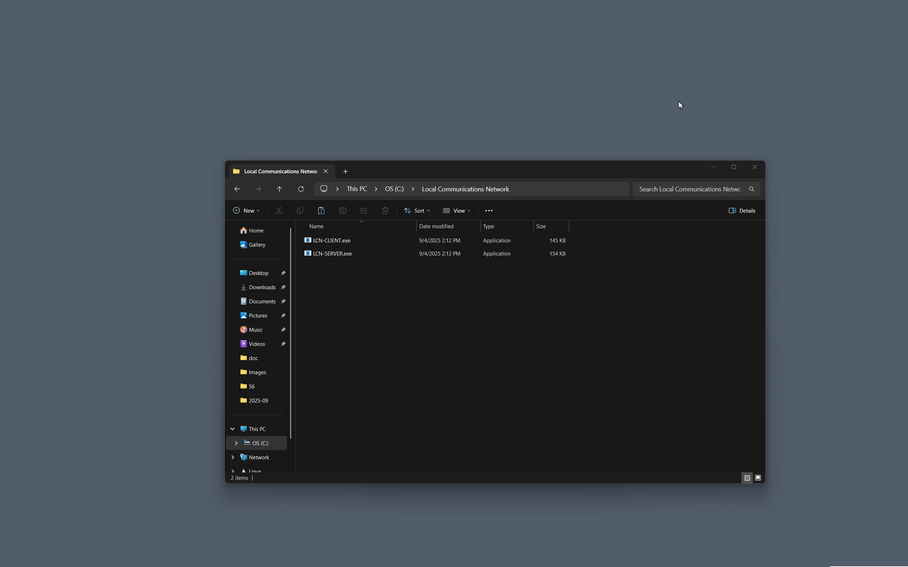

## Local Communications Network
A monolithic and ephemeral console-based chat server hosted on the loopback adapter.  
 

### Agenda
- [ ] Nickname registration
- [ ] Syntactic refactoring
- [ ] Programmatic SQL API
- [ ] A/B testing proxies for debugging
- [ ] Protocol variability
- [ ] Terminal-based client interface

## License
[MIT](https://raw.githubusercontent.com/tobynetizen/win-local-comm-net/refs/heads/master/LICENSE)